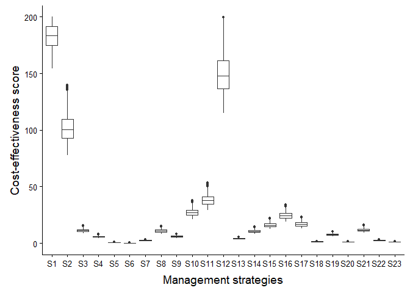
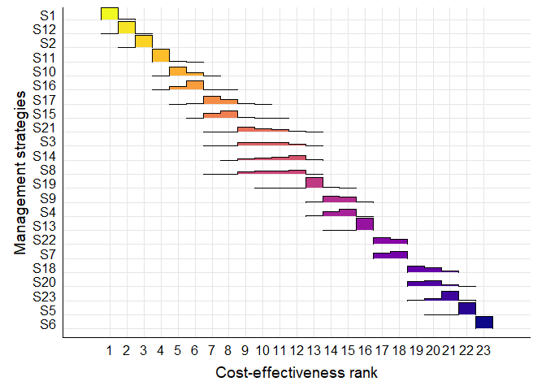

Calculate Cost-effectiveness
================
Adapted for the SJR PTM by Abbey Camaclang
3 July 2019

This code calculates cost-effectiveness scores and ranks strategies by Benefit, Cost, and CE Based on algorithm from Step 2 section of *1\_Cost-Effectiveness.R* code from FRE PTM project, but using a different way to implement.

Also performs uncertainty analysis for costs.

Requires **Estimates\_aggregated\_benefits\_groupwtd.csv** from *aggregateEstimates.R*, and a **CostFeas.csv** table of strategy cost and feasibility.
Load packages

``` r
library(tidyverse)
library(mc2d)
library(cowplot)
library(ggridges)
library(viridis)
library(here)
```

Set parameters

``` r
a <- 1000000 # scaling to get cost and benefits in roughly the same order of magnitude
uncrtn.anal <- 1 # 1 if running cost uncertainty analysis, 0 if not (to minimize run time)
MC <-  10000 # number of iterations for uncertainty analysis
u <- 0.3 # prop. variation from the best estimate
```

Read in group-weighted benefit values from *aggregateEstimates.R* and cost/feasibility table

``` r
# datafolder <- here("data")
resultfolder <- here("results")
ben.mat.agg <- read_csv(paste0(resultfolder, "/Estimates_aggregated_benefits_groupwtd_rev.csv"))
costfeas <- read_csv(paste0(resultfolder, "/CostFeas_rev.csv"))
costfeas <- costfeas[-1,] # Remove baseline values
costfeas$Strategy <- as_factor(costfeas$Strategy)
```

Calculate cost-effectiveness scores
-----------------------------------

CE = (Benefit \* Feasibility)/Cost

``` r
# Get Best Guess estimates and transpose so that Strategies are in rows and Groups are in columns
strat.ben <- data.frame(t(select(ben.mat.agg, contains("Best.guess"))))
names(strat.ben) <- ben.mat.agg$Ecological.Group

# Create vector of strategy names
strat.names <- vector()
strat.names[which(str_detect(rownames(strat.ben), "(?<=_)[:digit:]+")==1)] <- 
  paste0("S",str_extract(rownames(strat.ben)[which(str_detect(rownames(strat.ben), "(?<=_)[:digit:]+")==1)], "(?<=_)[:digit:]+"))
strat.names[which(str_detect(rownames(strat.ben), "(?<=_)[:digit:]+")==0)] <- 
  paste0("Baseline") # Rows without the "_" are Baseline estimates

# Add up (group-weighted) aggregated benefits of each strategy across ecological groups
sum.ben <- data.frame(strat.names, rowSums(strat.ben))
names(sum.ben) <- c("Strategy", "Benefit")
sum.ben$Strategy <- as_factor(as.character(sum.ben$Strategy))

# Join with cost/feasibility table and calculate cost-effectiveness
strat.est <- full_join(sum.ben, costfeas, by="Strategy") %>%
  mutate(., Sc.Cost = Cost/a, # scale costs to get reasonable values
         Exp.Benefit = Benefit * Feasibility, # weight benefits by feasibility
         CE = (Benefit * Feasibility)/Sc.Cost) # divide by scaled costs
  
# Rank strategies by Expected Benefit, Cost, and CE score and save results
CE_Score <- select(strat.est, c("Strategy", "Benefit", "Cost", "Feasibility", "Exp.Benefit","CE")) %>%
  mutate(., CE_rank = rank(-CE), 
         ExpBenefit_rank = rank(-Exp.Benefit), 
         Cost_rank = rank(Cost))

print(CE_Score)
```

    ##    Strategy    Benefit        Cost Feasibility Exp.Benefit          CE
    ## 1        S1  357.68840   1535127.1   0.8525000   304.92936 198.6346050
    ## 2        S2  321.00671   2945165.9   0.9217000   295.87188 100.4601754
    ## 3        S3  468.75560  25998802.9   0.6167000   289.08158  11.1190342
    ## 4        S4  323.95617  30166363.7   0.5250000   170.07699   5.6379678
    ## 5        S5  196.72028 136569590.7   0.5375000   105.73715   0.7742364
    ## 6        S6  314.27541 498094558.6   0.4083000   128.31865   0.2576191
    ## 7        S7   80.17655  15466504.7   0.4500000    36.07945   2.3327473
    ## 8        S8  158.01417   7691338.9   0.5200000    82.16737  10.6831030
    ## 9        S9  140.91340  12635565.0   0.5233000    73.73998   5.8359070
    ## 10      S10  116.97927   3261560.9   0.7500000    87.73445  26.8995292
    ## 11      S11   47.40000   1022670.1   0.8100000    38.39400  37.5428980
    ## 12      S12   68.62500    447493.8   0.9660000    66.29175 148.1400380
    ## 13      S13  152.07860  24067593.7   0.6416000    97.57363   4.0541497
    ## 14      S14   95.87840   4615486.0   0.4969000    47.64198  10.3222018
    ## 15      S15  186.22702   6595151.4   0.5625000   104.75270  15.8832898
    ## 16      S16  413.23240  10947045.0   0.6407000   264.75800  24.1853393
    ## 17      S17  641.06252  30479095.9   0.7969000   510.86272  16.7610852
    ## 18      S18  453.74894 187062858.3   0.5265000   238.89882   1.2771045
    ## 19      S19  556.66592  40700040.0   0.5433000   302.43660   7.4308673
    ## 20      S20  272.63301 139831151.6   0.6438000   175.52113   1.2552362
    ## 21      S21  565.57503  32149416.0   0.6553000   370.62132  11.5280887
    ## 22      S22 1036.23201 283965459.7   0.6542933   677.99969   2.3876132
    ## 23      S23 1071.57634 645490427.6   0.6456800   691.89541   1.0718911
    ##    CE_rank ExpBenefit_rank Cost_rank
    ## 1        1               5         3
    ## 2        3               7         4
    ## 3       10               8        13
    ## 4       15              12        14
    ## 5       22              14        18
    ## 6       23              13        22
    ## 7       18              23        11
    ## 8       11              18         8
    ## 9       14              19        10
    ## 10       5              17         5
    ## 11       4              22         2
    ## 12       2              20         1
    ## 13      16              16        12
    ## 14      12              21         6
    ## 15       8              15         7
    ## 16       6               9         9
    ## 17       7               3        15
    ## 18      19              10        20
    ## 19      13               6        17
    ## 20      20              11        19
    ## 21       9               4        16
    ## 22      17               2        21
    ## 23      21               1        23

``` r
# write_csv(CE_Score, "./results/CostEffectiveness_Scores.csv")
```

Uncertainty analysis for cost uncertainty
-----------------------------------------

``` r
if (uncrtn.anal == 1) {
  
  samples <- matrix(nrow = nrow(costfeas),ncol = MC)
  MC.CE_Score <- list()

  # get min and max
  min.Cost <- costfeas$Cost * (1-u)
  max.Cost <- costfeas$Cost * (1+u)
  best.Cost <- costfeas$Cost
  
  set.seed(3279)
  
  for (it in 1:MC) {
    
    # sample cost values
    samples[,it] <- rpert(nrow(costfeas),
                          min = min.Cost,
                          mode =best.Cost,
                          max = max.Cost, shape=4)
    costfeas$Cost <- samples[,it]

    # Join with cost/feasibility table and calculate cost-effectiveness
    strat.est <- full_join(sum.ben, costfeas, by="Strategy") %>%
      mutate(., Sc.Cost = Cost/a, # scale costs to get reasonable values
             Exp.Benefit = Benefit * Feasibility, # weight benefits
             CE = (Benefit * Feasibility)/Sc.Cost) # calculate cost-effectiveness scores

    # Rank strategies by (weighted)Benefit, Cost, and CE score
    CE_Score <- select(strat.est, c("Strategy", "Benefit", "Cost", "Feasibility", "Exp.Benefit","CE")) %>%
      mutate(., CE_rank = rank(-CE),
             ExpBenefit_rank = rank(-Exp.Benefit),
             Cost_rank = rank(Cost))
    
    MC.CE_Score[[it]] <- CE_Score
    
    } # end for
  
  # Get results and save as .csv files
  MC.CE_Table <- lapply(MC.CE_Score, "[", 1:length(strat.names), "CE")
  MC.Results <- matrix(unlist(MC.CE_Table), ncol = MC, byrow = FALSE)
  MC.Results <- data.frame(costfeas$Strategy, MC.Results)
  names(MC.Results)[1] <- "Strategy"
  
  MC.CE_Rank <- lapply(MC.CE_Score, "[", 1:length(strat.names), "CE_rank")
  MC.Ranks <- matrix(unlist(MC.CE_Rank), ncol = MC, byrow = FALSE)
  MC.Ranks <- data.frame(costfeas$Strategy, MC.Ranks)
  names(MC.Ranks)[1] <- "Strategy"

  MC_Samples <- data.frame(costfeas$Strategy, samples)
  
  # write_csv(MC.Results, "./results/Uncertainty_CEScores_cost.csv")
  # write_csv(MC.Ranks, "./results/Uncertainty_CERanks_cost.csv")
  # write_csv(MC_Samples, "./results/Uncertainty_SampledData_cost.csv")

  # Boxplot of CE scores
  
  # if loading previously saved data, use:
  # MC.Results <- read_csv("./results/Uncertainty_CEScores_cost.csv")
  MC.CE <- gather(MC.Results, key = MC.Iter, value = CE, 2:ncol(MC.Results))
  MC.CE$Strategy <- as_factor(MC.CE$Strategy)

  temp.plot <-
    ggplot(MC.CE, aes(x = Strategy # for each Ecological group, plot Estimate Type on x-axis
                      , y = CE # and St.Value on y-axis
                      )
           ) +
    geom_boxplot(
      lwd = 0.3 #lwd changes line width
      , fatten = 1 # thickness of median line; default is 2
      , outlier.size = 1 # size of outlier point
      ) + # tell R to display data in boxplot form
    theme_cowplot() +  # use the theme "cowplot" for the plots, which is a nice minimalist theme
    theme(
      axis.text = element_text(size = 10)
      , axis.line = element_line(size = 1)
      ) +
    scale_x_discrete(name = "Management strategies"
                     , breaks = MC.CE$Strategy
                     , labels = MC.CE$Strategy# Give the x-axis variables labels
                     ) +
    labs(x = "Management strategies"
         , y = "Cost-effectiveness score"
         ) +
    ylim(0, 200) # set the y-axis limits from 0-100
  
  # ggsave(filename=paste0("./results/Uncrtn_Cost_", MC, "R_Scores.pdf", sep = ""), temp.plot, width = 180, height = 115, units = "mm")
  # ggsave(filename=paste0("./results/Uncrtn_Cost_", MC, "R_Scores.tiff", sep = ""), temp.plot, width = 180, height = 115, units = "mm", dpi = 600)

  
  # Histogram of CE rank frequency
  MC.CE_r <- gather(MC.Ranks, key = MC.Iter, value = CE_rank, 2:ncol(MC.Ranks))
  MC.CE_r$Strategy <- as_factor(MC.CE_r$Strategy)
  
  count_ranks <- xyTable(MC.CE_r$Strategy, MC.CE_r$CE_rank)
  rank_table <- data.frame(count_ranks$x, count_ranks$y, count_ranks$number)
  rank_table_sort <- as_tibble(rank_table)
  names(rank_table_sort) <- c("Strategy", "CE_rank", "Count")
  rank_table_sort <- group_by(rank_table_sort, Strategy) %>%
    filter(Count == max(Count)) %>%
    arrange(desc(CE_rank))
  
  strat.order <- rank_table_sort$Strategy
  new.names <- paste0("S", strat.order)
  
  temp.plot.r <-
    ggplot(MC.CE_r, aes(y = factor(Strategy, levels = new.names)
                        , x = CE_rank
                        , fill = factor(Strategy, levels = new.names)
                        )
           ) +
    geom_density_ridges(stat = "binline", bins = 23, scale = 0.9, draw_baseline = FALSE) +
    theme_ridges(grid = TRUE, center_axis_labels = TRUE) +
    theme(
      legend.position = "none"
      , panel.spacing = unit(0.1, "lines")
      , strip.text = element_text(size = 8)
      , axis.ticks = element_blank()
      , axis.line = element_line(size = 0.3)
      , panel.grid = element_line(size = 0.3)
      ) +
    scale_fill_viridis(option = "plasma", discrete = TRUE) +
    labs(x = "Cost-effectiveness rank"
         , y = "Management strategies"
         ) +
    scale_x_continuous(breaks = c(1:23)
                       , labels = c(1:23) # Give the x-axis variables labels
                       # , limits = c(0, max(rank_table$count_ranks.x)+1)
                       )
  
  # ggsave(filename=paste0("./results/Uncrtn_Cost_", MC, "R_Ranks.pdf", sep = ""), temp.plot.r, width = 180, height = 180, units = "mm")
  # ggsave(filename=paste0("./results/Uncrtn_Cost_", MC, "R_Ranks.tiff", sep = ""), temp.plot.r, width = 180, height = 180, units = "mm", dpi = 600)
  
  } #end if

print(temp.plot)
```

    ## Warning: Removed 4834 rows containing non-finite values (stat_boxplot).



``` r
print(temp.plot.r)
```


