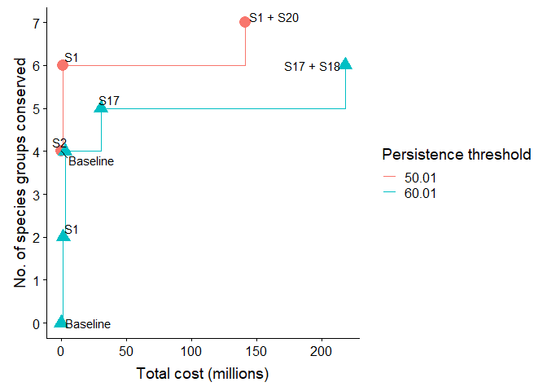
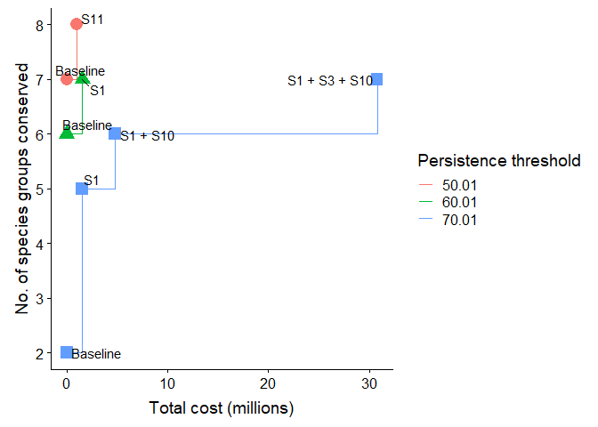
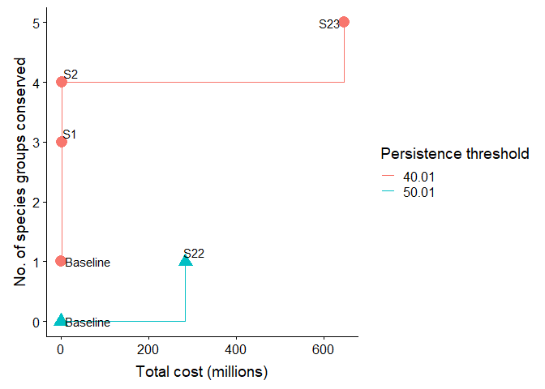
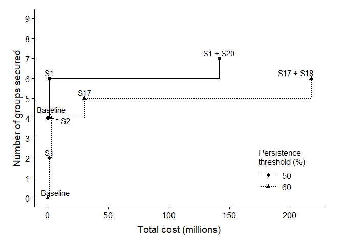
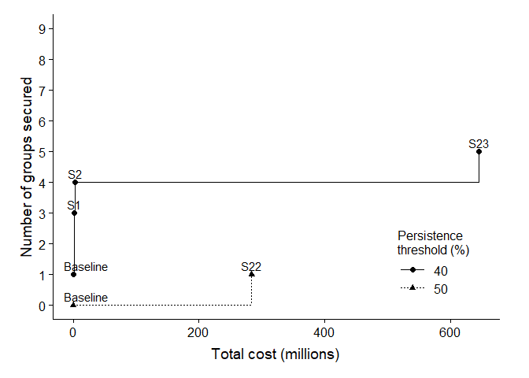
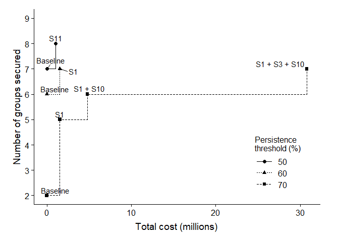

Optimize Threat Management
================
Adapted by Abbey Camaclang from instructions provided by Nicolai Cryer
21 Jan 2020

This code performs the complementarity analysis using the consOpt package developed by Nicolai Cryer <nkcryer@gmail.com> and updated by Abbey Camaclang with a number of bug fixes.

Requires **BestGuess.csv** from *getBenefitMatrix.R*, and an updated **CostFeas\_rev.csv** that includes estimated values for new 'All Strategies' combinations (S22 and S23).

If using for the first time, need to install and load packages.
Instructions for building and running the consOpt package: Method A:

``` r
# install.packages("devtools")
# library("devtools")
# devtools::install_github("ConservationDecisionsLab/consOpt") (AC: this has never worked properly for me)
```

OR Method B:
1) download/clone the github repository <https://github.com/ConservationDecisionsLab/consOpt>,
2) open up RStudio and open the RProj file in the downloaded directory
3) press "build and install" in the top right corner. This should restart the R session and automatically load the package.

I've run into some issues trying to install the updated package using Method B (but not the original version from <https://github.com/ncryer/consOpt>), but I was able to get it work after updating Rtools (and in some cases, also R/R Studio) and manually installing/updating various other required packages.

The required packages for the consOpt package may also need to be installed manually - see DESCRIPTION file for a list of required packages.

If the package(s) already installed, then load packages

``` r
library(consOpt)

library(tidyverse)
library(cowplot)
library(here)
```

Load data

``` r
resultfolder <- here("results")
datafolder <- here("data")
benefits.matrix <- read.csv(paste0(resultfolder, "/BestGuess.csv"), row.names = 1) # expected probability of persistence for each Strategy (rows) and Species Group (columns), including baseline
costfeas <- read_csv(paste0(datafolder, "/CostFeas_rev.csv")) # estimated Cost and Feasibility (columns 2 & 3) for each Strategy (col 1), including baseline
cost.vector <- costfeas$Cost
names(cost.vector) <- costfeas$Strategy
combo.strategies <- read.csv(paste0(datafolder, "/SJR_StrategyCombinations.csv"), header = TRUE) # list of individual strategies that make up each strategy (in columns). Should have a column for baseline and all strategies
```

Run the optimization routine across the default budgets and thresholds. For some sparse documentation, type ?Optimize

``` r
results <- Optimize(benefits.matrix=benefits.matrix, 
                    cost.vector=cost.vector, 
                    combo.strategies=combo.strategies
                    , thresholds = c(50.01, 60.01)
                    )
```

    ## =========================================================================

``` r
# write_csv(results, "./results/ComplementarityBest.csv")
```

If doing uncertainty analysis:

``` r
lower.benefits <- read.csv(paste0(resultfolder, "/Lower.csv"), row.names = 1)
upper.benefits <- read.csv(paste0(resultfolder, "/Upper.csv"), row.names = 1)

lower <- Optimize(benefits.matrix = lower.benefits,
                  cost.vector = cost.vector,
                  combo.strategies = combo.strategies
                  , thresholds = c(40.01, 50.01)
                  )
```

    ## =========================================================================

``` r
upper <- Optimize(benefits.matrix = upper.benefits,
                  cost.vector = cost.vector,
                  combo.strategies = combo.strategies
                  ) # default is already thresholds = c(50.01, 60.01, 70.01)
```

    ## ===========================================================================

``` r
# write_csv(lower, "./results/ComplementarityLower.csv")
# write_csv(upper, "./results/ComplementarityUpper.csv")
```

Plot the benefit curve and save

``` r
# Use plotting function included in the consOpt package:
optcurve <- PlotResults(results)
```



``` r
optcurve.u <- PlotResults(upper)
```



``` r
optcurve.l <- PlotResults(lower)
```



Or, create custom plot function (based on plotting function in the package):

``` r
library(viridis)
```

    ## Loading required package: viridisLite

``` r
PlotOptCurve <- function(summary.results, benefits.matrix, draw.labels=TRUE){
  # Create a plot object from the neat results table
  tmp <- summary.results
  # scale
  tmp$total_cost <- (tmp$total_cost / 10^6)
  tmp$threshold <- round(tmp$threshold) # removing decimal points
  
  # cbPalette <- c("#999999", "#E69F00", "#56B4E9", "#009E73", "#F0E442", "#0072B2", "#D55E00", "#CC79A7")
  
  # Create plot object
  this.plot <- ggplot(tmp, aes(
    x = total_cost, 
    y = number_of_species, 
    group = threshold, 
    linetype = factor(threshold),
    shape = factor(threshold), 
    label = strategies
  )
  ) +
    geom_step(
      # aes(color = factor(threshold)), 
      # size = 0.8,
      # alpha = 0.6
    ) +
    geom_point(
      # aes(color = factor(threshold)),
      size = 2
      # ,show.legend = FALSE
    ) +
    theme_cowplot() +
    theme(legend.justification = c(1,0),
          legend.position = c(0.95, 0.05),
          legend.key.height = unit(0.6,"cm"),
          legend.key.width = unit(1, "cm"),
          legend.title = element_text(size = 12),
          legend.text = element_text(size = 12),
          plot.margin = margin(0.5, 1, 0.5, 0.5, "cm")
          # legend.title.align=0.5
    ) +
    # scale_color_viridis(discrete=TRUE) +
    scale_y_continuous(
      # labels = function (x) floor(x), 
      breaks = min(tmp$number_of_species):length(benefits.matrix),
      limits = c(min(tmp$number_of_species), length(benefits.matrix))
    ) +
    labs(x = "Total cost (millions)", 
         y = "Number of groups secured"
         , linetype = "Persistence\nthreshold (%)"
         , shape = "Persistence\nthreshold (%)"
    )
  
  if(draw.labels){
    this.plot <- this.plot + 
      geom_text_repel(size = 4, nudge_y = 0.05, show.legend = FALSE)
  }
  
  plot(this.plot)
  this.plot
}

optcurve <- PlotOptCurve(results, benefits.matrix, draw.labels = TRUE)
```



``` r
optcurve.lower <- PlotOptCurve(lower, benefits.matrix, draw.labels = TRUE)
```



``` r
optcurve.upper <- PlotOptCurve(upper, benefits.matrix, draw.labels = TRUE)
```



``` r
# 
# ggsave("./results/ComplementarityBest.pdf", optcurve, width = 180, height = 120, units = "mm")
# ggsave("./results/ComplementarityBest.tiff", optcurve, width = 120, height = 115, units = "mm", dpi = 600)
# 
# ggsave("./results/ComplementarityLower.pdf", optcurve.lower, width = 180, height = 120, units = "mm")
# ggsave("./results/ComplementarityLower.tiff", optcurve.lower, width = 120, height = 115, units = "mm", dpi = 600)
# 
# ggsave("./results/ComplementarityUpper.pdf", optcurve.upper, width = 180, height = 120, units = "mm")
# ggsave("./results/ComplementarityUpper.tiff", optcurve.upper, width = 120, height = 115, units = "mm", dpi = 600)
```
